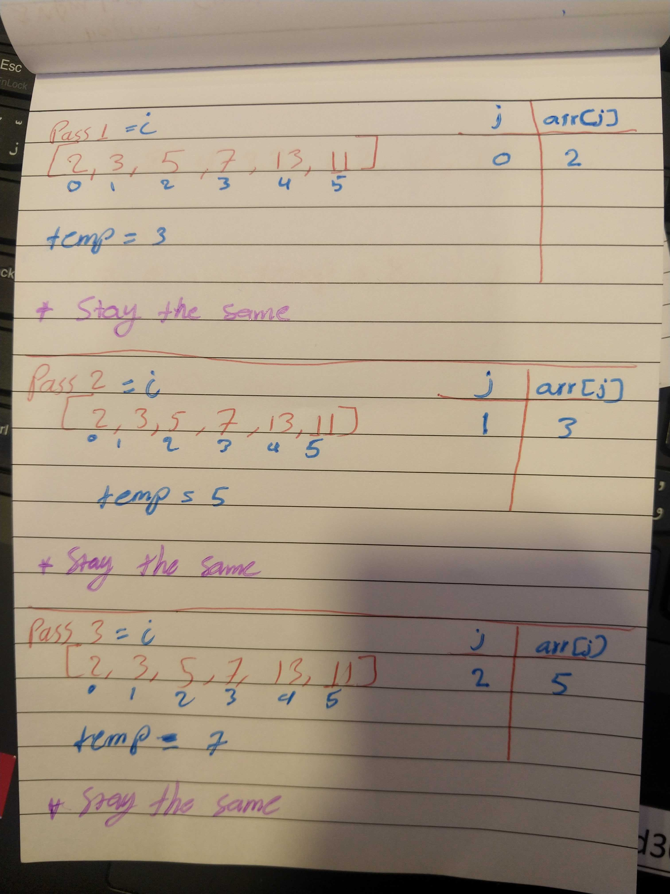
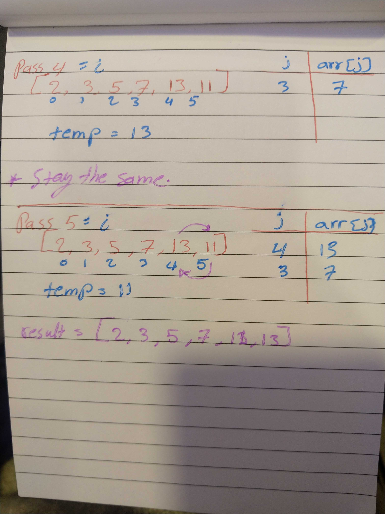

# Insertion Sort

## Pass 1:

* The function start with i of 1, it will assign the second value of the array to a variable named temp then comparing it to the previous value. Here the temp is bigger than the next value so no change will applied to the array.

## Pass 2:

* The same idea of goes here, since the third value bigger tthan the seond one, the array will be the same, no changes.

## Pass 3:

* the third trial not that different from the previous ones.

## Pass 4:

* Since the array from the first value until this point is sorted, the function will do nothing.

## Pass 5:

* Here the temp has value of 11 which is less 13 so it will enter the second loop, the second loop takes the value of the current element and assign it to the next one based on the second loop counter; which will make the array as follows `[2, 3, 5, 7, 13, 13]` 

* The statement after the while loop will take the temp value and assign it to the element of ` j = 4`