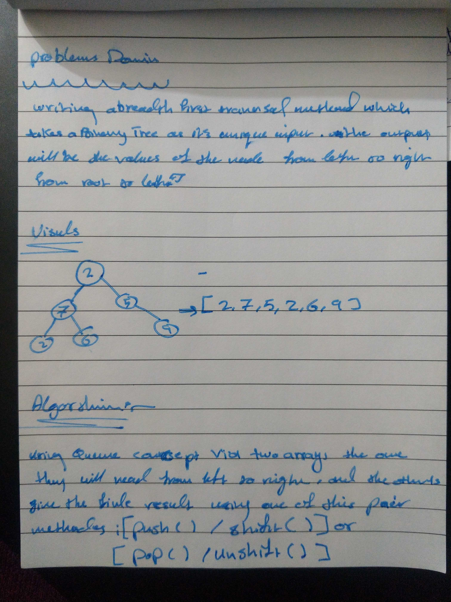

# Challenge Summary

## Challenge Description
- Take every single element of the tree using Breadth-first Traversal.

## Approach & Efficiency
`breadthFirst()`: This method takes Big O(n)

## Solution

