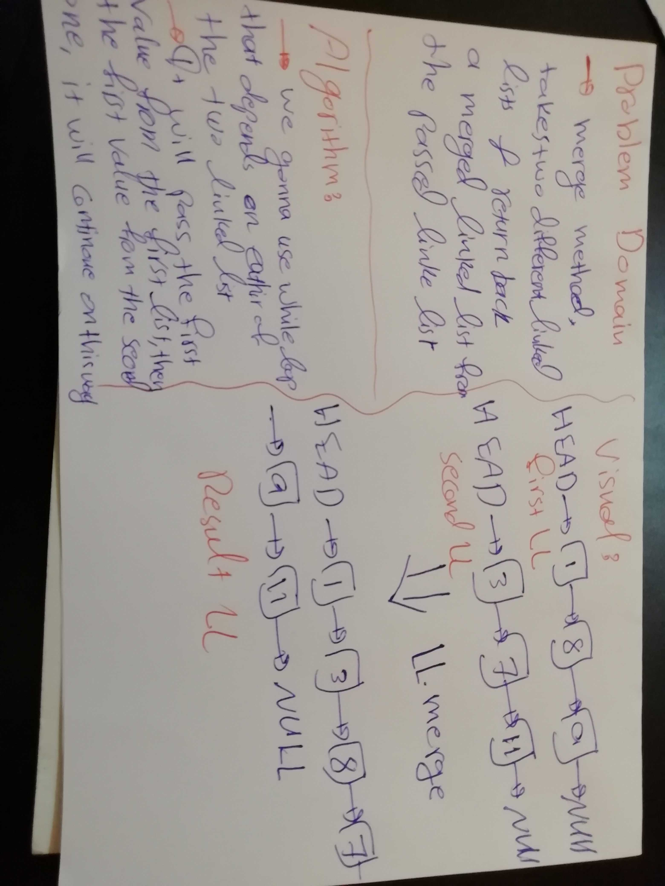

# Challenge Summary
This challenge makes you more familiar with linkedLists and how to do methods on them.

## Challenge Description
Here we are going to create a method to our linked list class that will take two arrays as arguments and return a result merged linked list.

## Approach & Efficiency
The Big O notation defines an upper bound of an algorithm, it bounds a function only from above. For example, consider the case of Insertion Sort. It takes linear time in best case and quadratic time in worst case.

## Solution
